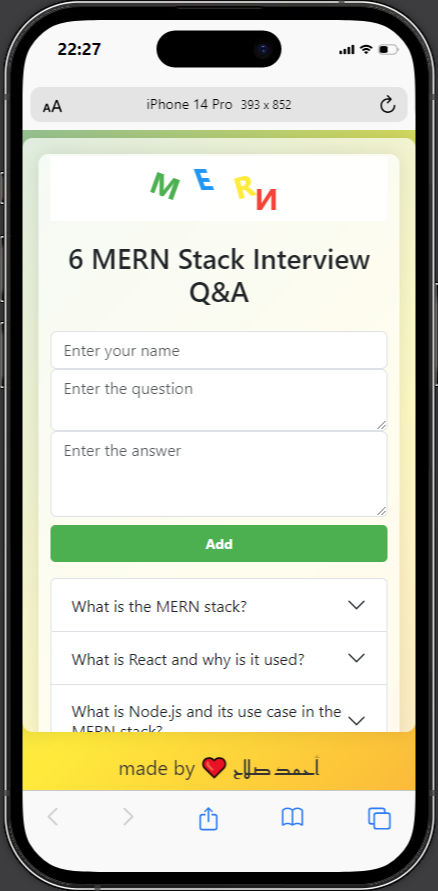
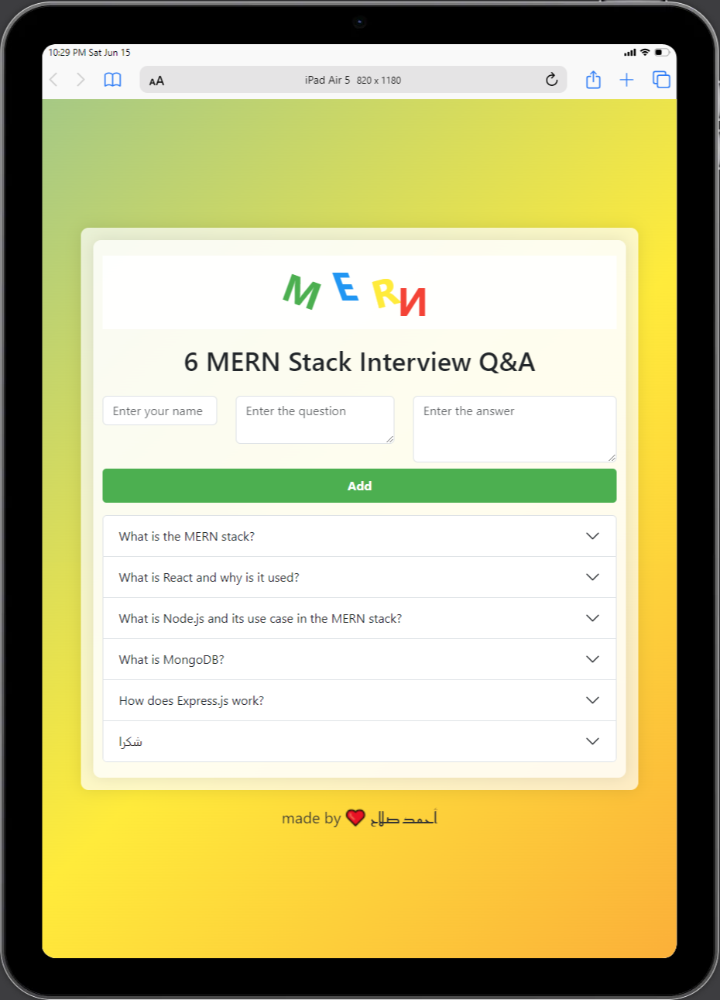
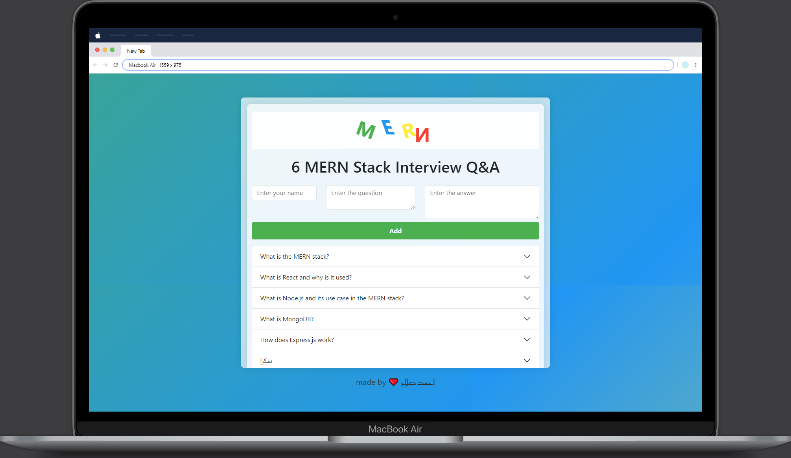

# MERN Stack Interview Q&A App

This project is a MERN Stack Interview Q&A application that allows users to add, view, and manage interview questions and answers related to the MERN stack (MongoDB, Express, React, Node.js).

## Table of Contents

- [Installation](#installation)
- [Usage](#usage)
- [Features](#features)
- [Technologies Used](#technologies-used)
- [Screenshots](#screenshots)
- [Contributing](#contributing)
- [License](#license)
- [Contact](#contact)

## Installation

1. Clone the repository:
    ```bash
    git clone https://github.com/Ahmedsalah000/Q-A.git
    cd my-app
    ```

2. Install the dependencies for both server and client:
    ```bash
    # For server
    cd server
    npm install

    # For client
    cd my-app
    npm install
    ```

3. Set up the environment variables:
    - Create a `.env` file in the `server` directory and add your MongoDB URI and any other required environment variables.
    - Example:
        ```env
        MONGO_URI=your_mongo_uri
        PORT=5000
        ```

## Usage

1. Start the server:
    ```bash
    cd server
    npm start
    ```

2. Start the client:
    ```bash
    cd my-app
    npm start
    ```

3. Open your browser and navigate to `http://localhost:3000` to use the application.

## Features

- Add new interview questions and answers.
- View a list of all interview questions.
- Responsive design for mobile and desktop views.
- Security enhancements using Helmet, XSS-clean, and Express-Mongo-Sanitize.

## Technologies Used

- **Frontend**:
  - React
  - React Bootstrap
  - Axios

- **Backend**:
  - Node.js
  - Express
  - MongoDB
  - Mongoose

- **Security**:
  - Helmet
  - XSS-clean
  - Express-Mongo-Sanitize
  ## Screenshots

Here are some screenshots of the application:

### mobile


### iPad


### Macbook


## Contributing

Contributions are welcome! Please follow these steps to contribute:

1. Fork the repository.
2. Create a new branch (`git checkout -b feature-branch`).
3. Make your changes and commit them (`git commit -m 'Add some feature'`).
4. Push to the branch (`git push origin feature-branch`).
5. Open a Pull Request.

## License

This project is licensed under the MIT License. See the [LICENSE](LICENSE) file for details.

## Contact

- **Author**: Ahmed Salah
- **Website**: [https://q-a-lake.vercel.app](https://q-a-lake.vercel.app)
- **Email**: [abushendy345@gmail.com](mailto:abushendy345@gmail.com)

Feel free to contact me if you have any questions or suggestions!
